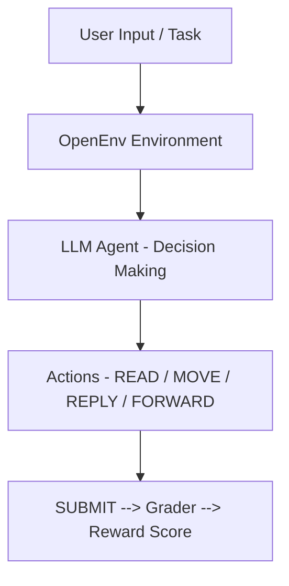

# 📧 Email Triage OpenEnv
> Automating real-world email workflows using AI agents — from spam filtering to customer support.

🏆 Built for the Meta PyTorch Hackathon — focused on real-world AI agent systems

🚀 An AI-powered email triage agent that reads, classifies, replies, and routes emails autonomously using OpenEnv and LLMs.

🌐 **Live Demo:** [https://huggingface.co/spaces/ayus1234/email-triage](https://huggingface.co/spaces/ayus1234/email-triage)

---

## 🌟 Overview

Modern inboxes are chaotic.

From spam filtering to handling refunds and forwarding invoices — email management is repetitive, time-consuming, and error-prone.

This project introduces a reinforcement learning environment (**OpenEnv**) that enables AI agents to:
- 📖 **Understand** emails
- 🧠 **Make decisions**
- ⚡ **Execute actions**
- ✅ **Complete workflows** autonomously

👉 *Simulating a real-world autonomous assistant.*

---

## 🚀 Why This Matters

Most AI systems today are limited to answering questions.

This project goes beyond that by enabling:
- 🧠 Decision making  
- ⚡ Action execution  
- 🔄 Multi-step workflows  

👉 Moving from **passive AI → agentic AI systems**

---

## 🎯 Problem Statement

Organizations deal with thousands of emails daily:
- ❌ **Manual sorting** wastes time
- ❌ **Incorrect routing** causes delays
- ❌ **Poor responses** affect user experience

👉 **Goal:** Build an AI agent that can autonomously manage an inbox with accuracy and reasoning.

---

## 💡 Solution – How It Works

We designed a structured OpenEnv environment where an agent must:
1. 📖 **Understand** email intent
2. 🗂 **Classify** messages correctly
3. 💬 **Generate** contextual replies
4. 📤 **Route** emails appropriately
5. ✅ **Submit** decisions for evaluation

### 🧠 Agent Capabilities

| Capability | Description |
| :--- | :--- |
| 📖 **Read** | Understand email content |
| 🗂 **Classify** | Identify spam vs important |
| 💬 **Respond** | Generate meaningful replies |
| 📤 **Forward** | Route emails correctly |
| ✅ **Submit** | Finalize task for scoring |

---

## ⚙️ Environment Design

### 📥 Observation Space (`EmailObservation`)
- `system_message` → Feedback from last action
- `inbox_summary` → List of emails (id, sender, subject, folder)
- `read_email_content` → Full email content
- `done` → Task completion flag
- `reward` → Current evaluation score

### 🎯 Action Space (`EmailAction`)
- `READ` → Open an email
- `MOVE` → Move email to folder
- `REPLY` → Respond to sender
- `FORWARD` → Send to another address
- `SUBMIT` → Trigger final evaluation

### 🧩 Task Design (Progressive Difficulty)
- 🟢 **Easy** — Spam Filtering: Identify and move spam email
- 🟡 **Medium** — Customer Support: Classify emails + reply to refund requests
- 🔴 **Hard** — Multi-step Workflow: Filter spam, respond to customer, and forward invoice to finance

---

## 🎯 Reward System
- Scores range between **0 and 1**
- Final score assigned only on `SUBMIT`

**Evaluation is based on:**
- ✔ Correct classification
- ✔ Accurate responses
- ✔ Proper routing

### 🔄 Example Workflow
`READ` → `Understand` → `MOVE` → `REPLY / FORWARD` → `SUBMIT` → `Reward`

---

## 📸 Demo

### 💬 Intelligent Email Handling (Refund Request)

📌 *Live agent execution showing reasoning, action, and final reward*

The agent:
1. Reads a customer refund email
2. Generates a professional reply
3. Completes the task with a reward score

---

🚀 **Step-by-step execution of the AI agent:**

### 📖 Step 1: Understanding the Email
The agent reads and understands the customer’s request.


---

### 💬 Step 2: Generating Response
The agent generates a context-aware reply to the customer.


---

### ✅ Step 3: Task Completion & Evaluation
The agent completes the workflow and receives a reward score.


---

### 🧪 Playground Interaction
You can test the agent via the OpenEnv interface:
**Steps:**
1. Click **Reset**
2. Perform actions: `READ` → `MOVE` → `REPLY / FORWARD`
3. Click **SUBMIT**

---

## ⚡ Quick Example

**Email:**  
"Hi, I would like a refund for order #456."

**Agent Actions:**
- READ → Understand request  
- REPLY → Generate response  
- SUBMIT → Complete task  

**Result:**
- ✅ Context-aware reply  
- 📊 Reward score  
- ✔ Task completed

---

## 🏗️ Architecture Overview



---

## 🛠️ Setup & Run

```bash
# Build environment
docker build -t email_triage-env:latest server/

# Validate OpenEnv setup
openenv validate

# Run agent
python inference.py
```

---

## 🔥 Key Highlights
- 🧠 **Real-world inspired** environment
- ⚙️ **Multi-step reasoning** tasks
- 🎯 **Robust reward system**
- 🤖 Designed for **LLM-based agents**
- 🔍 **Clear evaluation** pipeline
- 🚀 **Scalable architecture**

---

## 🌍 Real-World Applications
- 📧 Automated email assistants
- 🛎 Customer support automation
- 🏢 Enterprise workflow management
- 💼 Finance & invoice routing

---

## 🚀 Future Scope

- 🔗 Integration with Gmail / Outlook APIs  
- 🤖 Advanced LLM-based reasoning  
- 📊 Dashboard for analytics  
- 🧠 Multi-agent collaboration systems

---

## 👥 Team OpenAgents

Built for **Meta PyTorch Hackathon x Scaler School of Technology** 🚀

**Contributors:**
- **Ayush Nathani** – Lead & Core Implementation
- **Amrit Sugandh** – Team Member
- **Rajababu Kumar** – Team Member

---

## 🏁 Final Note

This project demonstrates how AI agents can move beyond simple Q&A and execute real-world workflows autonomously.

👉 **From understanding intent → taking action → completing tasks, this is a step toward truly agentic AI systems.**
